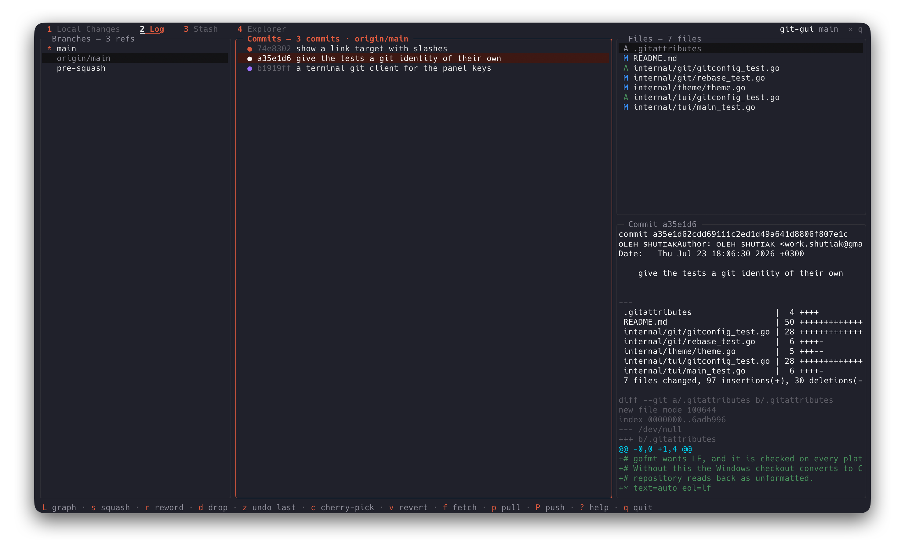

# git-gui

A terminal git client: tabbed workspaces, one key per action, one static binary.



`/` narrows any list, `v` swaps the diff for a side-by-side one, and `b` annotates the
file with who last touched each line.

## Why

A git client is read far more often than it is typed at, and what is wanted is usually
one question answered: what changed, who touched this line, what would this push send.
Panes that each get a third of the screen answer none of them well. So the screen is one
workspace at a time, every pane at full height, everything else a number key away, and
every action that cannot be walked back asks first.

## Tabs

| Key | Tab | Panes |
|---|---|---|
| `1` | Local Changes | the changed files, and the selected file's diff |
| `2` | Log | branches and tags, commits, and the commit's files over its patch |
| `3` | Stash | the entries, the selected entry's files, and their diff |
| `4` | Explorer | the parent directory, the current one, and what git knows about the selection |

## Install

macOS and Linux:

```sh
curl -fsSL https://raw.githubusercontent.com/o19k/git-gui/main/install.sh | sh
```

That fetches the binary for your platform, checks it against the published SHA-256 and
puts it in `/usr/local/bin` if you can write there or `~/.local/bin` if you cannot. It
never uses `sudo`: a script piped in from the network should not be the thing that decides
to run as root. Pick the version or the destination yourself with `VERSION=v1.2.3` and
`BINDIR=~/bin`.

If piping a script into a shell makes you uneasy — a reasonable instinct — read it first
([`install.sh`](install.sh), 120 lines), or skip it entirely: download the binary for your
platform from the [releases][releases] page, `chmod +x` it and put it on your `PATH`.
There is nothing to install beyond that one file — no runtime, no dependencies.

**Windows:** download `git-gui_windows_amd64.exe` from the [releases][releases] page. No
install script — PowerShell would need its own, and one untested installer is worth more
than two.

With a Go toolchain, from source:

```sh
go install github.com/o19k/git-gui/cmd/git-gui@latest
```

Or from a clone, stamping the version the way a release does:

```sh
go build -trimpath -ldflags "-s -w -X main.version=$(git describe --tags --always)" \
  -o git-gui ./cmd/git-gui
```

[releases]: https://github.com/o19k/git-gui/releases

## Use

```sh
git-gui            # current directory
git-gui ~/code/x   # a specific repository
git-gui -mouse     # with wheel scrolling and click-to-select
```

Any subdirectory of a repository works — the root is resolved for you.

`-mouse` is off by default: capturing the mouse takes away the terminal's own text
selection, and copying a line out of a diff is worth more than scrolling that `j`, `k`
and `ctrl+d` already do. With the flag on, the wheel scrolls whatever the pointer is
over and a click selects the row it lands on.

## Keys

**Everywhere**

| Key | Action |
|---|---|
| `1` – `4` | open a tab |
| `tab`, `shift+tab` | move between the tab's panes |
| `h` `l`, `←` `→` | previous / next pane |
| `j` `k`, `↓` `↑` | move the selection, or scroll a diff pane |
| `g` `G` | first / last |
| `/` | filter the focused list — `enter` keeps it, `esc` clears it |
| `v` | unified or side-by-side diff |
| `ctrl+f` `ctrl+b` | page the diff |
| `ctrl+d` `ctrl+u` | half-page the diff |
| `T` | light or dark |
| `R` | refresh now |
| `y` / `Y` | copy the selected path / its full path, over OSC 52 |
| `?` | keys |
| `q` | quit — asks first; `ctrl+c` does not |

**Commit checks** — commands that must pass before `c` records a commit. One failure holds
the commit back with that command's output and an explicit "commit anyway".

```sh
git config --add gitgui.check 'go test ./...'
git config --add gitgui.check 'gofmt -l .'
```

**Remote**

| Key | Action |
|---|---|
| `f` | fetch and prune |
| `p` | pull — fast-forward only, and offers a way out when that is not possible |
| `P` | push — lists the commits it would publish, then asks |
| `F` | force push with `--force-with-lease` — asks first |

**Changes**

| Key | Action |
|---|---|
| `space` | stage / unstage — or mark a conflict resolved |
| `m` | mark a file — `space`, `d` and `x` then act on every marked one |
| `a` / `u` | stage everything, untracked included / take the whole index back out |
| `enter` | pick hunks in the diff pane |
| `c` | commit the index |
| `A` | amend the last commit (prompt pre-filled) |
| `b` | annotate the file with blame — who last touched each line |
| `H` | the commits that touched this file |
| `s` | stash everything |
| `r` | resolve a conflict — keep ours, keep theirs, or mark it resolved |
| `t` | untrack, leaving the file on disk — asks first |
| `i` | add to `.gitignore`, untracking it too if git follows it — asks first |
| `d` | discard changes — asks first |
| `x` | delete from disk — asks first |
| `o` | show this file in the Explorer |

**Conflicts** — `r` on an unmerged file offers ours, theirs, or the file as it stands;
`space` marks it resolved. Same three for a merge, a rebase, a cherry-pick and a pull.

**Branches**

| Key | Action |
|---|---|
| `enter` | check out (a remote branch creates the local tracking branch) |
| `n` | new branch at HEAD |
| `c` | compare with the current branch — `f` switches the file list's scope |
| `m` | rename (prompt pre-filled) |
| `M` | merge into the current branch |
| `r` | rebase the current branch onto this one — asks first |
| `d` / `D` | delete / force-delete — asks first |
| `d` / `D` on a remote branch | delete it on the remote — asks first, and there is no force to ask for |

**Hunks** (`enter` from Changes)

| Key | Action |
|---|---|
| `j` `k` | next / previous hunk |
| `space` | stage this hunk — or unstage it, when the staged diff is showing |
| `esc` | back to the file list |

**Commits**

| Key | Action |
|---|---|
| `s` | squash into the commit below it |
| `r` | reword |
| `d` | drop — asks first |
| `K` / `J` | move later / earlier in history |
| `c` | cherry-pick onto the current branch |
| `v` | revert |
| `z` | undo the last commit, keeping what it held as staged changes — asks first |
| `t` | change the date — asks first, since it rewrites what follows |
| `n` | new branch starting at this commit |
| `P` | push only as far as this commit, leaving the rest local — asks first |
| `H` | on the file list: the commits that touched that file |
| `L` | draw the branch graph beside the commits |

**Stash**

| Key | Action |
|---|---|
| `space` | apply |
| `enter` | pop |
| `d` | drop — asks first |

**Stash files** (the middle pane)

| Key | Action |
|---|---|
| `space` | mark a path |
| `u` | restore the marked paths — or just the selected one — asks first |

**Explorer**

| Key | Action |
|---|---|
| `h` / `l`, `←` / `→` | step out of a directory, and into one — on a file, `l` moves into its preview and `h` comes back |
| `j` / `k`, `↓` / `↑` | move the listing, or scroll the preview when it holds the focus |
| `enter` | into a directory, or open a file in `$VISUAL` / `$EDITOR` |
| `e` | cycle the preview: content, diff, blame, history |
| `o` | jump to any path in the repository |
| `O` | show this file in Local Changes |
| `s` | search file contents — opens the file scrolled to the match |
| `,` | order the listing: name, git status, extension, size, modified |
| `.` | show dotfiles |
| `n` / `N` | new file, new directory |
| `m` | rename — `git mv` when git holds a copy |
| `x` | delete — `git rm` when git holds a copy, asks first |
| `i` | ignore |
| `M` | mark a path, so the next action reaches all of them |

## Test

```sh
go test ./...          # parsers, layout, end-to-end against a real repository
go test -race ./...    # also covers the concurrent load
```
